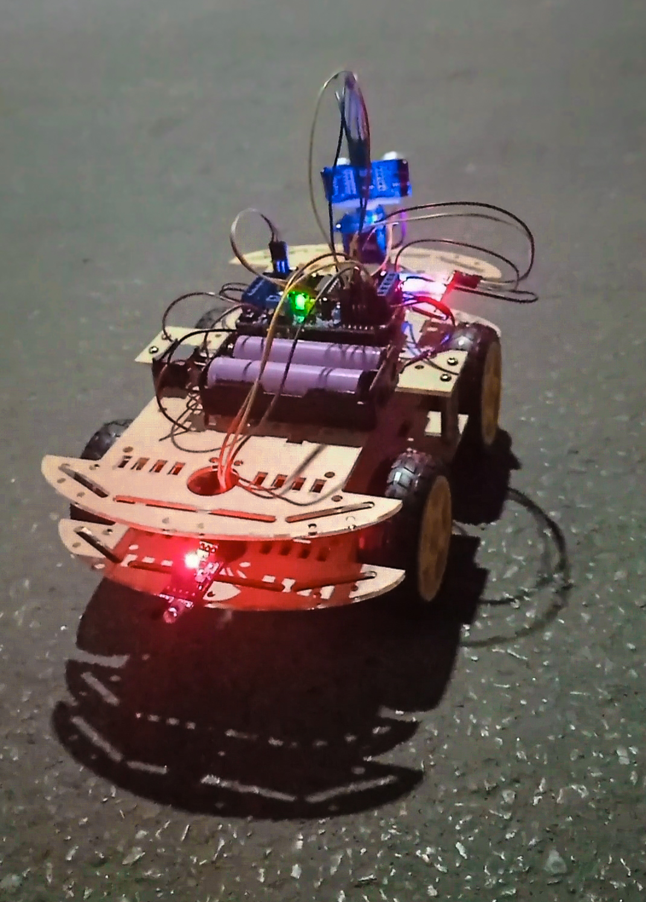
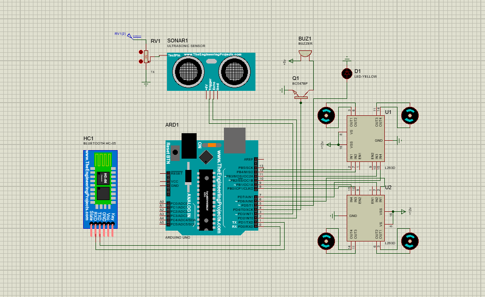

## Bluetooth Control Remote Car
This is an obstacle avoidance remote control bluetooth car made with Arduino UNO R3 which is controlled via mobile application.  Sonar sensor and IR sensor is used to detect forward and backward obstacle/object. We did an initial simulation implementation first then we jump to the final implementation and hardware installation.

## [View project on YouTube:](https://youtu.be/0HFX_0YsL38)
https://youtu.be/0HFX_0YsL38

## Features & Functionalities
* This car is controlled using mobile application.
* The car can go forward, backward, turn left and turn right.
* We can stop this car using break button form mobile app.
* Can rotate 360 degree
* Sonar sensor is used in front and IR sensor backward of the car to detect any kind of obstacle/object.
* If the sensors detect any kind of obstacle/object infront or backward of the car the car will be stopped automatically even we cannot run it forcefully at this time.


### Used Tools/Hardware

```bash
1. Arduino UNO R3
2. HC06 Bluetooth Module
3. L293D Motor Driver Shield
4. DC Gear Motors
5. 65mm Rubber Wheel
6. SG90 Servo Motor  
7. Ultrasonic Sonar Sensor
8. Infrared Sensor Module
9. 3.7V 18650 Lithium Battery
10. Battery Holder
11. On/OFF Switch
12. Jumper Wire
13. Car case
```
## Car Pictures


 ## Simulation Figure 
 